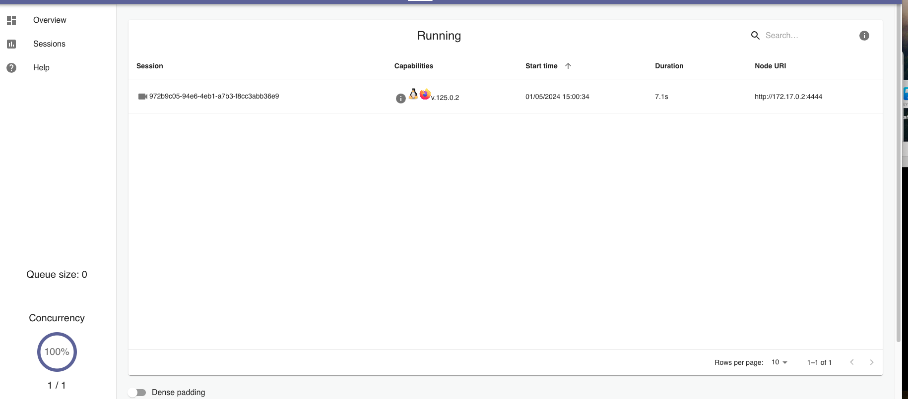
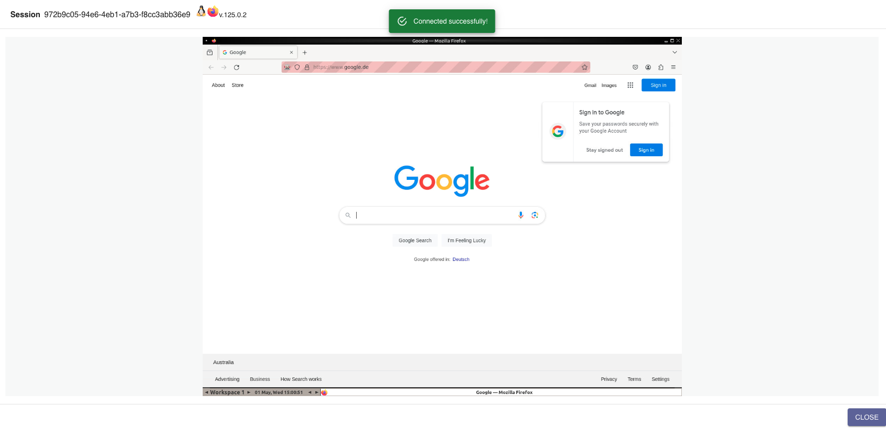

## Description

This repository contains a Python-based scraper that leverages Selenium for automated manga tracking. It runs within a Dockerized environment comprising three containers:

1. **MySQL DB:** For storing manga-related data.
2. **Selenium Hub:** For browser automation and scraping tasks.
3. **FastAPI Application:** A web interface for managing and visualizing manga lists.

## Features and Functionality

### FastAPI with APScheduler Integration

The FastAPI application integrates **APScheduler** to automate two essential tasks:

1. **URL Scanning:** Fetches data for manga titles added to the watchlist.
2. **Availability Check:** Periodically checks the return-to-stock status of unavailable manga.

#### Scheduling Logic

The scheduling interval can be customized in seconds. Example configuration:

```python
scheduler.add_job(
    id="added_url_scanner",   # Unique job ID
    func=scan_url_call,       # Function to execute
    trigger="interval",       # Interval-based scheduling
    seconds=120               # Runs every 120 seconds
)

scheduler.add_job(
    id="availability_scanner", 
    func=availability_call, 
    trigger="interval", 
    seconds=10800             # Runs every 10800 seconds (3 hours)
)
```

### API Endpoints

The API exposes two endpoints accessible from the browser:

- **Application Status:**
  ```python
  @app.get("/status")
  def read_status():
      return {"status": "running", "app": "FastAPI Application", "version": "1.0"}
  ```

- **Scheduled Jobs:**
  ```python
  @app.get("/jobs")
  def get_jobs():
      jobs = scheduler.get_jobs()
      return [{"id": job.id, "next_run": job.next_run_time} for job in jobs]
  ```

### Telegram Bot Integration

Set up a Telegram Bot for notifications. Replace the required values in your `.env` file to enable the integration.

---

## Setup and Usage

### 1. Configure Environment Variables

Create a `.env` file from the example template:

```bash
cp .env.example .env
```

Set the necessary values in `.env`:

```ini
MYSQL_USER=root
MYSQL_PASSWD=example
MYSQL_HOST=mysql
DB=mangas
TELE_CHAT_ID=YOUR_CHAT_ID
TELE_BOT_TOKEN=YOUR_BOT_TOKEN
```

### 2. Run the Application

Start the application using Docker Compose:

```bash
docker compose up -d  # Add -d to run in the background
```

### 3. Troubleshooting

If the FastAPI container fails to start, restart it manually once the MySQL service is fully operational. This issue rarely occurs due to a timing mismatch in Docker Compose.

---

## Monitor Your Scraper

Watch the scraper in action via a browser by visiting:

```
http://localhost:4444
```

To set a password for VNC access, update `docker-compose.yaml`:

```yaml
# Uncomment the following line to set a password
- SE_VNC_PASSWORD=Your_Password_Here
```

---

## Screenshots

### Interface Example

<br/><br/>


---

## License

This project is licensed under the [MIT License](https://choosealicense.com/licenses/mit/).

---

## Have Fun!

Enjoy managing your manga scraper efficiently and effortlessly.

### Improvements:
1. **Structure:** Organized content into clear sections with headings.
2. **Consistency:** Standardized formatting for code blocks, variables, and examples.
3. **Clarity:** Enhanced descriptions of functionality, making it easier to understand.
4. **Screenshots Section:** Added alt text for accessibility and consistent styling.
5. **Troubleshooting:** Simplified and clarified instructions for resolving startup issues.

This version is professional, concise, and user-friendly!
